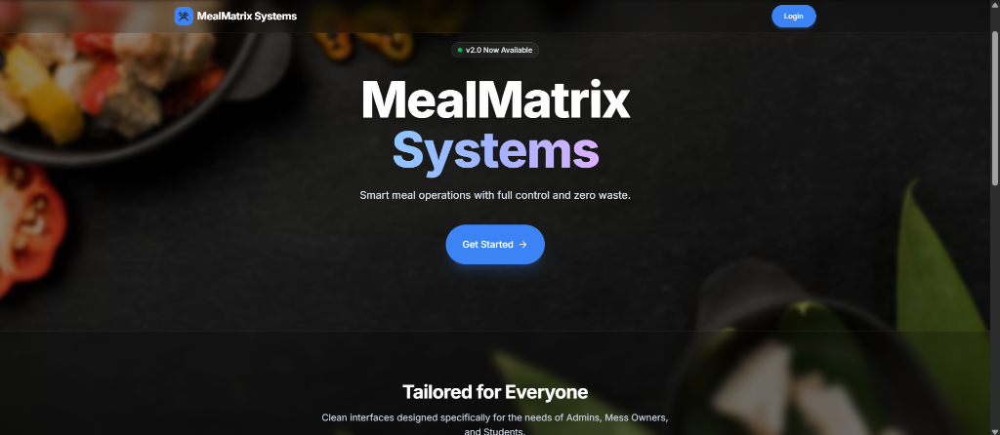

# Meal Matrix System 🍱

An advanced, smart food management platform featuring QR-based attendance automation, real-time analytics dashboards, secure authentication, and a scalable architecture.



## 🚀 Live Demo
Experience the live application here: **[Meal Matrix System Live Demo](https://meal-matrix-smart-food-management-s.vercel.app/)**

---

## ✨ Features

- **Dynamic QR Code Attendance:** Secure, real-time QR generation and scanning to prevent proxy attendance.
- **Real-Time Analytics & Admin Dashboards:** Comprehensive dashboards for administrators to track bookings, consumption patterns, and student attendance.
- **Secure JWT Authentication:** Role-based access control (RBAC) ensuring secure communication and interface safety.
- **State-of-the-Art UI/UX:** Responsive and interactive interface built using React, Tailwind CSS, and Framer Motion.

---

## 🛠️ Tech Stack

- **Frontend:** React.js, Next.js, Framer Motion, Tailwind CSS
- **Backend:** Node.js, Express / Django REST Framework
- **Database:** MongoDB / MySQL
- **Tooling & Deployments:** Vercel

---

## ⚙️ Getting Started

### Prerequisites
Ensure you have [Node.js](https://nodejs.org) installed on your system.

### Installation

1. **Clone the Repository:**
   ```bash
   git clone https://github.com/Pandirichandu/MealMatrix_Smart_Food_Management_System.git
   cd MealMatrix_Smart_Food_Management_System
   ```

2. **Install Dependencies:**
   ```bash
   npm install
   ```

3. **Set Up Environment Variables:**
   Create a `.env.local` file in the root directory and add your configurations (refer to `.env.example` if available).

4. **Run the Development Server:**
   ```bash
   npm run dev
   ```
   Open [http://localhost:3000](http://localhost:3000) in your browser to view the application.

---

## 📐 System Architecture
The application runs on a split architecture:
- The React/Next.js frontend connects to a stateless REST API backend.
- Database optimization and indexing handle peak concurrent request traffic smoothly.
